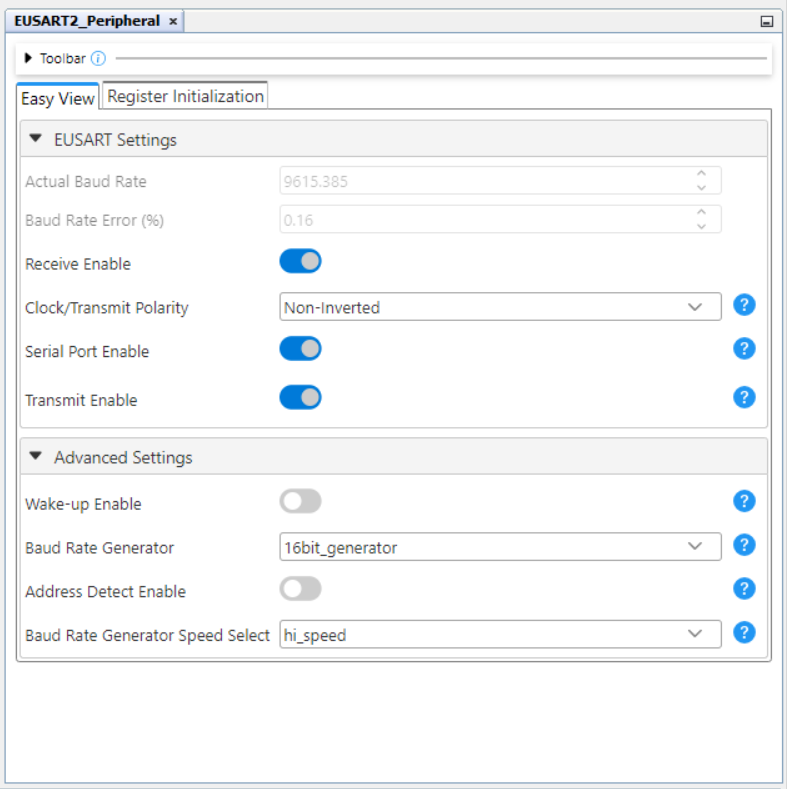
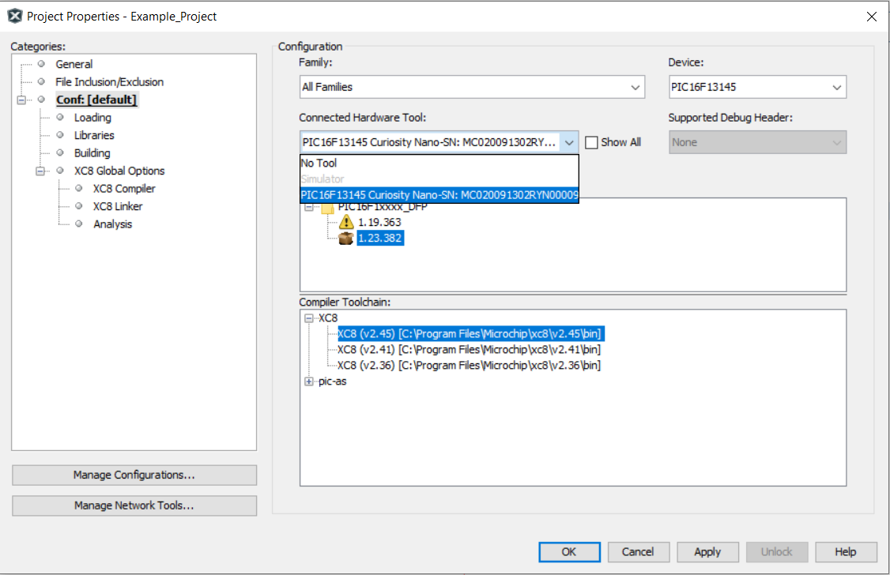

# Receive Control Commands via EUSART Using the PIC18f47Q10 Microcontroller with MCC Melody

This example shows how to implement a command line interface. This way, the microcontroller can receive control commands via the EUSART. In this use case, an LED is controlled using commands sent from the MPLAB Data Visualizer.

## Related Documentation

More details and code examples on the PIC18F47Q10 can be found at the following links:

- [PIC18F47Q10 Product Page](https://www.microchip.com/en-us/product/pic18f47q10?utm_source=GitHub&utm_medium=TextLink&utm_campaign=MCU8_MMTCha_PIC18F47Q10&utm_content=pic18f47q10-cnano-eusart-commands-mcc&utm_bu=MCU08)
- [PIC18F47Q10 Code Examples on Discover](https://mplab-discover.microchip.com/v2?dsl=PIC18F47Q10)
- [PIC18F47Q10 Code Examples on GitHub](https://github.com/microchip-pic-avr-examples/?q=PIC18F47Q10)
- [TB3282 - Getting Started with UART using EUSART on PIC18](https://www.microchip.com/wwwappnotes/appnotes.aspx?appnote=en1003086)

## Software Used

- [MPLAB X IDE v6.20 or newer](https://www.microchip.com/en-us/tools-resources/develop/mplab-x-ide?utm_source=GitHub&utm_medium=TextLink&utm_campaign=MCU8_MMTCha_PIC18F47Q10&utm_content=pic18f47q10-cnano-eusart-commands-mcc&utm_bu=MCU08)
- [MPLAB® XC8 v2.46 or newer](https://www.microchip.com/en-us/tools-resources/develop/mplab-xc-compilers?utm_source=GitHub&utm_medium=TextLink&utm_campaign=MCU8_MMTCha_PIC18F47Q10&utm_content=pic18f47q10-cnano-eusart-commands-mcc&utm_bu=MCU08)
- [PIC18F-Q_DFP v1.25.433 or newer](https://packs.download.microchip.com/)

## Hardware Used

- The [PIC18F47Q10 Curiosity Nano Development board](https://www.microchip.com/en-us/development-tool/dm182029?utm_source=GitHub&utm_medium=TextLink&utm_campaign=MCU8_MMTCha_PIC18F47Q10&utm_content=pic18f47q10-cnano-eusart-commands-mcc&utm_bu=MCU08) is used as a test platform:
   

## Operation

To program the Curiosity Nano board with this MPLAB X project, follow the steps provided in the [How to Program the Curiosity Nano Board](#how-to-program-the-curiosity-nano-board) chapter.  

## Setup

The following peripheral and clock configurations are set up using the MPLAB Code Configurator (MCC) Melody for the PIC18F47Q10:

1. Clock Control:

- Clock Source: HFINTOSC
- HF Internal Clock: 4 MHz
- Clock Divider: 4
   

2. UART2:

- UART PLIB Selector: EUSART2
- Requested Baud Rate: 9600
- Data Size: 8
- Redirect Printf to Uart: Enabled
   

3. EUSART2 Peripheral:

- Receive Enable: Enabled
- Clock/Transmit Polarity: Non-Inverted
- Serial Port Enable: Enabled
- Transmit Enable: Enabled
- Baud Rate Generator: 16-bit generator
- Baud Rate Generator Speed Select: High speed
   

4. Pins:

- RD1 - EUSART2 TX
- RD0 - EUSART2 RX
- RE0 - LED0, Start High
   

The following configurations must be made for this project:

|        Pin         | Configuration  |
| :----------------: | :------------: |
| RD0 (EUSART2 - TX) | Digital output |
| RD1 (EUSART2 - RX) | Digital input  |
|     RE0 (LED0)     | Digital output |

## Demo

Run the code and configure the Data Visualizer as described in the Technical Brief document. Type commands to be sent to the board. The two available commands are "ON" and "OFF". Observe the LED on the board as it changes its state according to the command sent.

 

## Summary

One important usage of the EUSART represents the implementation of a command line interface. This way, the microcontroller can receive control commands via EUSART. It is convenient to use the line terminator as command delimiter, so for this use case, EUSART will read full lines and then check if the line contains a valid command.

## How to Program the Curiosity Nano Board

This chapter demonstrates how to use the MPLAB X IDE to program a PIC® device with an Example_Project.X. This is applicable to other projects.

1.  Connect the board to the PC.

2.  Open the `Example_Project.X` project in MPLAB X IDE.

3.  Set the `Example_Project.X` project as main project.
     Right click the project in the **Projects** tab and click **Set as Main Project**.
     

4.  Clean and build the `Example_Project.X` project.
     Right click the `Example_Project.X` project and select **Clean and Build**.
     

5.  Select **PICxxxxx Curiosity Nano** in the Connected Hardware Tool section of the project settings:
     Right click the project and click **Properties**.
     Click the arrow under the Connected Hardware Tool.
     Select **PICxxxxx Curiosity Nano** (click the **SN**), click **Apply** and then click **OK**:
     

6.  Program the project to the board.
     Right click the project and click **Make and Program Device**.
     

 

---

## Menu

- [Back to Top](#receive-control-commands-via-eusart-using-the-pic18f47q10-microcontroller-with-mcc-melody)
- [Back to Related Documentation](#related-documentation)
- [Back to Software Used](#software-used)
- [Back to Hardware Used](#hardware-used)
- [Back to Operation](#operation)
- [Back to Setup](#setup)
- [Back to Demo](#demo)
- [Back to Summary](#summary)
- [Back to How to Program the Curiosity Nano Board](#how-to-program-the-curiosity-nano-board)
